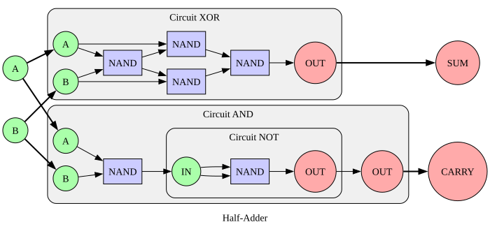

# SheNANDigans

## What's this project?

This is a toy playground to explore the beauty of the NAND gate.

It started as a way to experiment with creating the smallest possible encoding of logical circuits, but it took on a life of its own with nested circuit definitions, visualization, simulation, and more to come!

## What are NANDs anyway?

The NAND is a logic gate: it has two inputs that can be true or false, and it produces an output that is false only if both inputs are true. (Its name comes from the fact that it's the complement of the AND gate: NOT + AND.)

This simple rule has an awesome property: from it, every possible logic gate can be realized, without any other component. This is what's called [functional completeness](https://en.wikipedia.org/wiki/Functional_completeness). It's possible to create all other "basic" gates (NOT, AND, OR, XOR, etc), and higher-level circuits like multiplexers or adders… and that goes on and on until you reach the logic core of a CPU! [nand2tetris](https://www.nand2tetris.org/) is a course that takes this simple idea and goes all the way up to a CPU, and then even crosses the boundary into software. I can't recommend it enough!

## What does this pile of Python files do?

Well, there's not really (for now!) a single entry point or even some kind of main script... But the core is here! Here's some features:

Defining logical circuits in Python recursively. For example, without any context, here's a half-adder that adds two bits:

```py
def build_half_adder(library):
    half_adder = Circuit("Half-Adder")

    half_adder.add_component("XOR", library.get_circuit("XOR"))  # Previously defined
    half_adder.add_component("AND", library.get_circuit("AND"))

    half_adder.connect_input("A", "XOR", "A")
    half_adder.connect_input("B", "XOR", "B")
    half_adder.connect_input("A", "AND", "A")
    half_adder.connect_input("B", "AND", "B")

    half_adder.connect_output("AND", "OUT", "CARRY")
    half_adder.connect_output(XOR", "OUT", "SUM")

    return half_adder
```

A way to simulate them:

```py
half_adder = build_half_adder()
simulator = build_simulator(half_adder, OptimizationLevel.FAST)  # Automatically optimized
result = simulator.simulate([True, False])
assert result == [False, True]  # 1 + 0 = 01
```

And a way to encode and decode:

```py
builder = PlaygroundCircuitBuilder()
builder.build_circuits()
library = builder.library

reference_encoding: bitarray = DefaultEncoder().encode(library)
round_trip_library = DefaultDecoder().decode(reference_encoding)
round_trip_encoding = DefaultEncoder().encode(round_trip_library)

assert reference_encoding == round_trip_encoding
```

And, last but not least, a way to visualize:

```py
# Graphviz' dot must be available in $PATH
graph = generate_graph(
    half_adder,
    GraphOptions(is_compact=True, is_aligned=True, bold_io=True)
)
save_graph(graph, "half_adder", "svg")
```



## Encoding size performance

`PlaygroundCircuitBuilder` contains (almost) all basic logic gates, and adders up to 8 bits, and is encoded into *262 bytes (TODO * 2 ????) *\* using the default encoder, and **78 bytes** using the bit packed version!

These 78 bytes can't be compressed further using either the zlib or lzma library, so that's pretty good!

nand2tetris's first two projects, which contains a lot of basic logic gates (including Mux and DMux), numeric operations, and culminates into a complete ALU, can be encoded into only **1169 bytes**!

Unfortunately, the lzma library can compress to 1067 bytes. It's only a ≈9% reduction, but it's still frustrating! 

\* The default decoder use int numbers. There are considerd to be encoded into 16 bits.

## What's next?

I have lots of ideas:

- Encode the circuits into even less bits.
- Fast parallelized simulations
- A simple DSL to define circuits
- Automated optimization and search
- Define simple fantasy or real-world chips

If you want to see french rambling, look at the `scratchpad*.md` files, there's a lot of ideas in there.

## What's this "archive" directory?

Digital hoarding is a serious illness. I can't delete the dark past...

TODO : precise ZERO and ONE ?